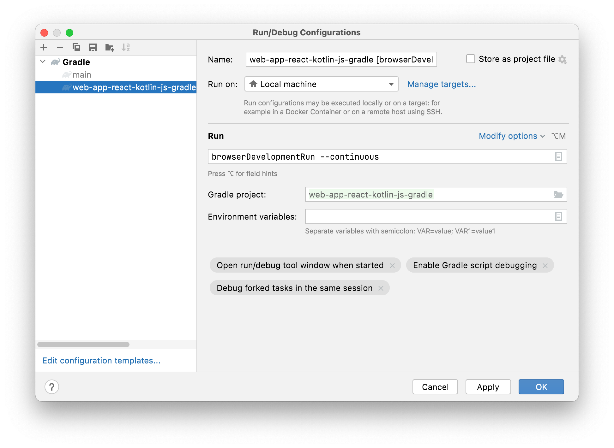

# Setting up

### Prerequisites

To get started, let's make sure we have installed an up-to-date development environment. All we need to get started is:

- IntelliJ IDEA (version `2021.2` or above) with the Kotlin plugin (`1.5.31` or above) – [Download/Install](https://www.jetbrains.com/idea/download/)


### Setting up the project

For this tutorial, we have made a starter template available that includes all configuration and required dependencies for the project.

[**Please clone the project repository from GitHub, and open it in IntelliJ IDEA.**](https://github.com/kotlin-hands-on/web-app-react-kotlin-js-gradle)

The template repository contains a basic Kotlin/JS Gradle project for us to build our project. Because it already contains all dependencies that we will need throughout the hands-on, **you don't need to make any changes to the Gradle configuration.**

It is still beneficial to understand what we'll be using for our app. Let's have a closer look at the project template and the dependencies and configuration it relies on.

#### Gradle dependencies and tasks

In this hands-on, use React, some external dependencies, and even some Kotlin-specific libraries.

The `dependencies` block in our `build.gradle.kts` file contains everything we'll need:

```kotlin
dependencies {

    //React, React DOM + Wrappers (chapter 3)
    implementation("org.jetbrains.kotlin-wrappers:kotlin-react:17.0.2-pre.264-kotlin-1.5.31")
    implementation("org.jetbrains.kotlin-wrappers:kotlin-react-dom:17.0.2-pre.264-kotlin-1.5.31")
    implementation(npm("react", "17.0.2"))
    implementation(npm("react-dom", "17.0.2"))

    //Kotlin Styled (chapter 3)
    implementation("org.jetbrains.kotlin-wrappers:kotlin-styled:5.3.3-pre.264-kotlin-1.5.31")
    implementation(npm("styled-components", "~5.3.3"))

    //Video Player (chapter 7)
    implementation(npm("react-youtube-lite", "1.1.0"))

    //Share Buttons (chapter 7)
    implementation(npm("react-share", "4.4.0"))

    //Coroutines & serialization (chapter 8)
    implementation("org.jetbrains.kotlinx:kotlinx-coroutines-core:1.5.2")
    implementation("org.jetbrains.kotlinx:kotlinx-serialization-json:1.3.0")
}
```


#### HTML page

Kotlin/JS, just like all other JavaScript in the browser, always needs to run inside an HTML page. The template includes some HTML in `/src/main/resources/index.html`:

```xml
<!doctype html>
<html lang="en">
<head>
    <meta charset="UTF-8">
    <title>Hello, Kotlin/JS!</title>
</head>
<body>
    <div id="root"></div>
    <script src="confexplorer.js"></script>
</body>
</html>
```

In this snippet, we're embedding a JavaScript file called `confexplorer.js`.
The Kotlin/JS Gradle plugin takes care of bundling our whole project and its dependencies into that single JavaScript file, named the same as our project. (If you're working in a project you've named `followingAlong`, make sure to embed `followingAlong.js` instead.)

As is typical [JavaScript convention](https://faqs.skillcrush.com/article/176-where-should-js-script-tags-be-linked-in-html-documents), we first load the content of our body (including the `#root` div), and then finally load our scripts, to ensure that all page elements we need have already been loaded by the browser.

The template also starts us out with a simple code example, just to verify that everything is working fine, and we're good to go. The file `src/main/kotlin/Main.kt` contains the following snippet, which just turns the whole page red:

```kotlin
// . . .

fun main() {
    document.bgColor = "red"
}
```

Now, we need to compile, run, and serve our code.

### Running the development server

The Kotlin/JS Gradle plugin comes by default with support for an embedded `webpack-dev-server`.
This allows us to run the application from our IDE without having to manually set up any kind of server.

We can start the development server by invoking the `run` or `browserDevelopmentRun` task from the Gradle tool window inside IntelliJ IDEA. They are inside the `other` and `kotlin browser` task group, respectively:


Alternatively, you can run the application in the terminal using `./gradlew run` in the root of the project.

After our project is compiled and bundled, a browser window pops open and shows us the red, blank page mentioned before, showing that everything's working properly:


#### Enabling hot reload / continous mode

Manually compiling and executing our project every time we want to see the changes we made is tedious.
Instead, we can use the _continuous compilation_ mode supported by Kotlin/JS and Gradle.
While running in this mode, the compiler will watch for changes we make in our code, automatically recompile, and reload the page while. Let's set it up.

(Make sure to stop all running development server instances before proceeding.)

After running the Gradle `run` task for the first time from the IDE, IntelliJ IDEA automatically generates a run configuration for it, which we can use to turn on continuous compilation:


In the "Run/Debug Configurations" dialog, we add the `--continuous` flag to the arguments for the run configuration:



We then apply the changes to our run configuration.
After applying the changes to our run configuration, we can use the "Run" button inside IntelliJ IDEA to start our development server back up.

If you're using the terminal, you can invoke continous mode by running `./gradlew run --continuous`.

Let's make a change while that task is running! Let's switch `red` to `blue` in our `main` function, and save the change:

```kotlin
document.bgColor = "blue"
```

 After a few seconds, the project should be recompiled, and the page automatically reloads, having changed color.

Feel free to keep the development server running in continuous mode while going through this tutorial. It will watch for the changes we make in our code, and automatically rebuild and reload our project for us.

### Ready, set...

We have set up our blank slate of endless possibilities. Let’s get started!

You can find the state of the project after this section on the `master` branch in the [GitHub](https://github.com/kotlin-hands-on/web-app-react-kotlin-js-gradle/tree/master) repository.

